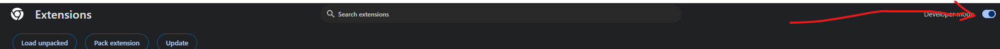
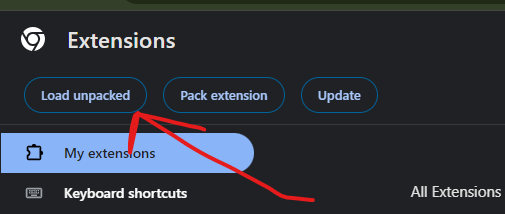
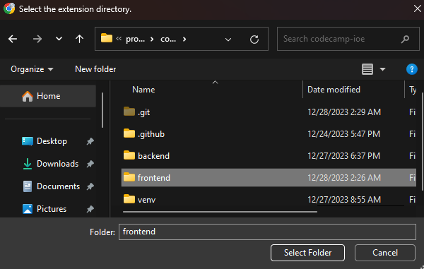
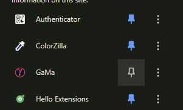
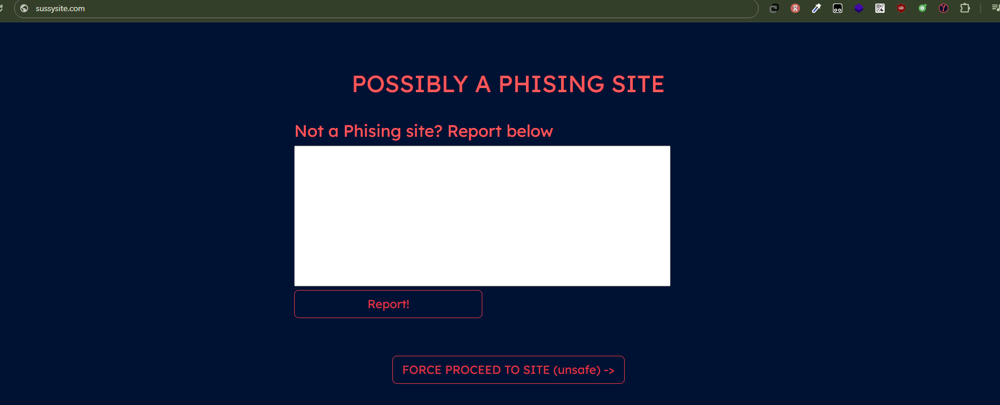
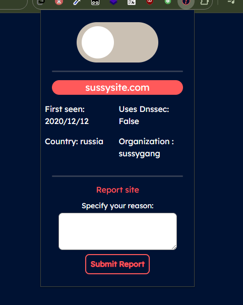
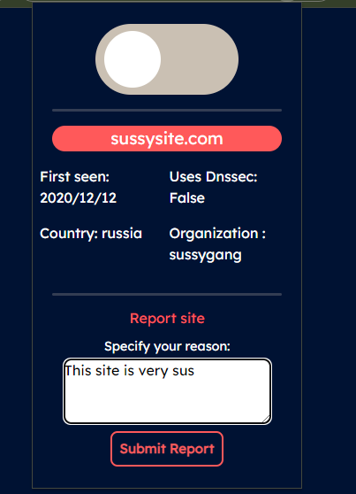
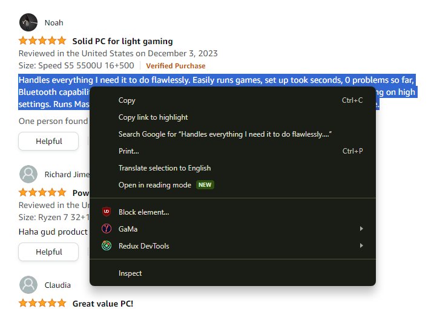
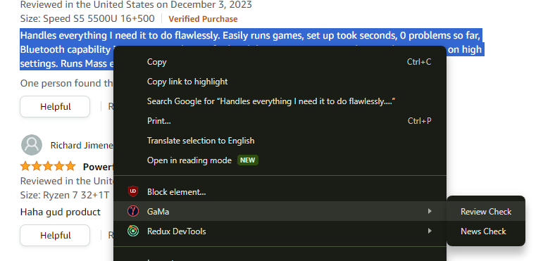
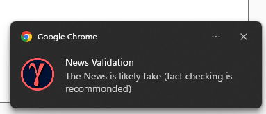

# Gama (2<sup>nd</sup> runner up in Locus codecamp 2023)

Our project revolves around the idea of building a browser extension that empowers users to navigate the web with confidence by detecting and warning them about phishing sites, fake reviews, and other online threats.

## Requirements

- Python 3.11
- Whois cli
- pip

## Installation

Install gama with git & pip

```bash
    > git clone https://github.com/PhuyalGaurav/gama.git
    # now be in the gama folder & make a venv
    > cd gama
    \gama> python -m venv venv
    # install all the dependencies
    \gama> venv\Scripts\activate
    (venv) .. \gama> pip install -r requirements.txt


```

## Deployment

To deploy this project run

```bash
  # be in the root gama folder
  # make sure you have your venv activated
  \gama>venv\Scripts\activate
  (venv) .. \gama> cd backend
  (venv) .. \gama\backend> python app.python
  # Now the local server should be running
```

## Use of some thechnologies and why?

| Libraries Used   | Why?                                                                                                                                                                                                      |
| ---------------- | --------------------------------------------------------------------------------------------------------------------------------------------------------------------------------------------------------- |
| Fast API         | We Used to fast api. Because it is very light weight and also new!, we also went with a api approach so that other developers can use our api to integrate it in thier own applications                   |
| Sk Learn         | Since our data set was quite small . We went with sklearn rather than tensorflow. Also with our limited hardware we could train with it easier than tensorflow that utilizes heavy & expensive cuda cores |
| Whois            | We choose whois cli instead of an api because we wanted to keep this as free as possible and also keep the delay between front & backend small.                                                           |
| Chrome extention | we went with chrome extension to make this as usable as possbile & reach as many people as possible we are planning to add firefox in the future so that it reaches mobie uses too                        |

## File tree

```
gama/
├─ .github/
│  ├─ 0.png
│  ├─ 10.png
│  ├─ 11.png
│  ├─ 12.png
│  ├─ 8.png
│  ├─ 9.png
│  ├─ image-1.png
│  ├─ image-2.png
│  ├─ image-3.png
│  ├─ image-4.png
│  ├─ image-5.png
│  ├─ image-6.png
│  └─ image-7.png
├─ .gitignore
├─ LICENSE
├─ README.md
├─ backend/
│  ├─ Datasets/
│  │  ├─ amazon_reviews_2019.csv
│  │  ├─ fake_news_dataset.csv
│  │  └─ phishing_site_urls.csv
│  ├─ MLModels/
│  │  ├─ fakeNewsModel.pkl
│  │  ├─ fakeNewsVectorizer.pkl
│  │  ├─ phishing.pkl
│  │  ├─ reviewModel.pkl
│  │  └─ reviewVecotorizer.pkl
│  ├─ app.py
│  ├─ db/
│  │  └─ db.sqlite3
│  ├─ helpers.py
│  ├─ models.py
│  └─ news_predictor.py
├─ frontend/
│  ├─ background.js
│  ├─ contentScript.js
│  ├─ logo.png
│  ├─ manifest.json
│  ├─ override.html
│  ├─ overrideJs.js
│  ├─ overrideStyles.css
│  ├─ popup.html
│  ├─ popup.js
│  └─ styles.css
├─ proposal.pdf
└─ requirements.txt
```

- .github/ contains all of the images needed for github read me
- backend/ contains the backend code
  - datasets/ contains all data sets used to train our models
  - MLModels/ contains all the machine learning models
- Fronend/
  - contains code for extention

## Python files

### app.py

Contains all the code for running the fast api server.

### helpers.py

Contains all the helper function & Review model with its text pre processor

### news_predictor.py

Contains the class for preding if a news is Fake or not.

### models.py

Contains database models and pydantic shecma models.

## API Reference

#### Check For phishing

```http
  GET /phishing?url=
```

| Parameter          | Type     | Description                                     |
| :----------------- | :------- | :---------------------------------------------- |
| `url` **Required** | `string` | Gives true if phishing link detected else false |

#### Get all reports

```http
  GET /reports
```

| Parameter | Type | Description                                                     |
| :-------- | :--- | :-------------------------------------------------------------- |
| None      | none | Returns all the reports that are repoted by user (saved on db). |

#### Get details about a website

```http
  GET /details?url=
```

| Parameter | Type   | Description                                      |
| :-------- | :----- | :----------------------------------------------- |
| url       | string | the link of the website whose details is neededs |

| value returned     | Type   | Description                                                     |
| :----------------- | :----- | :-------------------------------------------------------------- |
| Name               | string | Returns all the reports that are repoted by user (saved on db). |
| registrar          | string | The registrar of the domain.                                    |
| registrant_country | string | The country of the registrant.                                  |
| creation_date      | Date   | The date when the domain was created.                           |
| expiration_date    | Date   | The date when the domain will expire.                           |
| last_updated       | Date   | The date when the domain was last updated.                      |
| dnssec             | bool   | The registrant of the domain.                                   |
| registrant         | string | Returns all the reports that are repoted by user (saved on db). |
| emails             | string | The associated emails of the domain.                            |
| country_name       | string | The country name of the domain.                                 |

#### Report a website by a user

```http
  POST /report
```

| Parameter | Type   | Description                                  |
| :-------- | :----- | :------------------------------------------- |
| Url       | string | url of the website which is to be blocked    |
| reason    | string | the reason why the website should be blocked |

#### Report a mis identified website by a user

```http
  POST /report_mistake
```

| Parameter | Type   | Description                                    |
| :-------- | :----- | :--------------------------------------------- |
| Url       | string | url of the website which is to be unblocked    |
| reason    | string | the reason why the website should be unblocked |

#### Check if a review is real of fake through ML

```http
  POST /review
```

| Parameter | Type   | Description                       |
| :-------- | :----- | :-------------------------------- |
| review    | string | The review which is to be checked |

| Value returned | Type | Description            |
| :------------- | :--- | :--------------------- |
| prediction     | bool | True if review is fake |

#### Check if a news is real of fake through ML

```http
  POST /news
```

| Parameter | Type   | Description                     |
| :-------- | :----- | :------------------------------ |
| news      | string | The news which is to be checked |

| Value returned | Type | Description            |
| :------------- | :--- | :--------------------- |
| prediction     | bool | True if review is fake |

#### Make a specic review to primary check

```http
  PUT /reports/{id}?real=
```

| Parameter | Type    | Description                                   |
| :-------- | :------ | :-------------------------------------------- |
| id        | integer | the id of the report to be made ture or false |
| real      | bool    | The boolen value of the report to be set.     |

# How to use the extention

- After the server has been set up. Add the frontend extention to your web browser
  . Make sure that developer mode is enabled.



- Now Load unpacked



- Now select the frontend folder from gama directory



- Now the extention should be installed. go ahead and pin it. so:



- Now the extention is installed!


- Your extention should be shown like this with details



- Now whenever you visit a suspisous site the above screen is shown protecting you from online threats

- If you wish to Disable this just click the checkbox



- If you ever find a site that seems suspicous you can report it by just reporting it in the textbox like so:



- If you want to check for a fake review then highlight the text and right click



- Now click on gama and click on Review check



- Now you should get a notification like this:


- If you would like to check for fake news follow the same process just click on news check :
  
- Then you should get a notification like this



## Appendix

- The python server is easily uploadable to the web & serve use through online apis
- The apis can be used by 3rd party apps too.
- The machine learning models are trained on datasets found on kaggle (With the creators permission )

## Model accuracies (pre tested)

- Fake News Model : 81.23%
- Phishing Detector Model : 78.93%
- Fake Review Model : 73.22%

## License

[MIT](https://choosealicense.com/licenses/mit/)

## Refrences

Thank you manideep2510 for letting us use their pre-trained fake news detection model

> [His repo](https://github.com/manideep2510/siamese-BERT-fake-news-detection-LIAR)

## Authors

- [@phuyalgaurav90](https://www.github.com/phuyalgaurav90)

- [@munannoo](https://www.github.com/munannoo)
